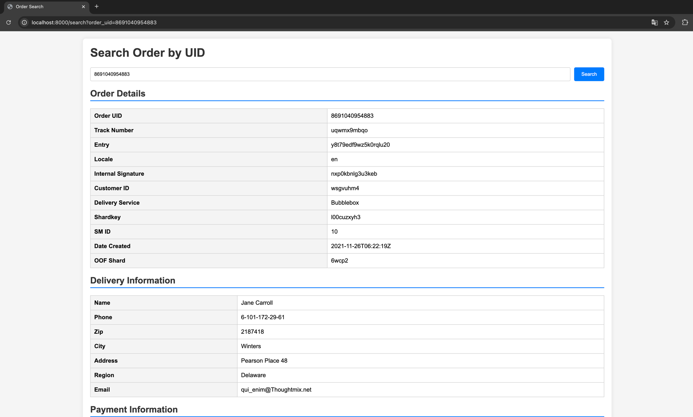
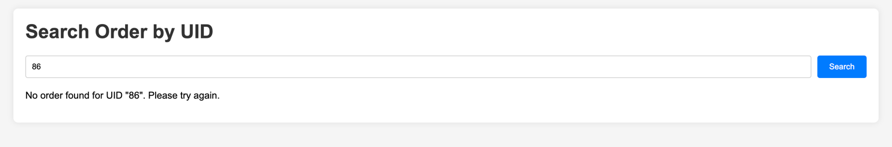

# wbL0

# Сервис просмотра заказа

## Описание задачи
Необходимо разработать демонстрационный сервис с простейшим интерфейсом, отображающий данные о заказе.

## Инструкции по сборке
- Для миграций базы данных в проект:
```bash
make db_up
```
- Для запуска сервиса:
```bash
make run
```
- Для запуска скрипта по отправлению фейковых заказов:
```bash
make pub
```
- Также есть возможность отправлять заказы через POST запрос:
```
"http://localhost:8000/add"
```
- Для удаления базы данных:
```bash
make db_down
```

### Пример простейшего интерфейса
- Форма заказа:
  

- Если заказ не найден:
  

## Cтек
- **Язык сервиса:** Go.
- **База данных:**  PostgreSQL.